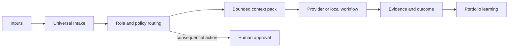

# ABVX-OS

**A local-first control plane for a personal AI operating system.**

[](https://github.com/markoblogo/ABVX-OS/actions/workflows/ci.yml)
[](https://github.com/markoblogo/ABVX-OS/actions/workflows/agentsgen-pr-guard.yml)
[](https://github.com/markoblogo/ABVX-OS/releases)
[](https://www.python.org/)
[](LICENSE)

ABVX-OS turns projects, opportunities, evidence, professional roles, and approval rules into inspectable local state. It helps a human and AI tools decide what context to load, which specialist stance to use, what may run, and where a human decision is required.

It is an active reference implementation and the maintainer's working system. The reusable core is intentionally dependency-light; personal records and publishing artifacts remain data, not a required runtime.

## See it work

```sh
git clone https://github.com/markoblogo/ABVX-OS.git
cd ABVX-OS
./bin/abvx --version
./bin/abvx validate
./bin/abvx role route --text "Research a market and prepare a book brief" --json
./bin/abvx portfolio inspect
```

The first three commands are read-only. `validate` checks the versioned schemas, registries, fixtures, evidence, and operating contracts. Role routing is deterministic and grants no tools or authority. See the [five-minute quick start](docs/QUICKSTART.md) before using commands that change local state.

## What is implemented

| Capability | Current behavior |
| --- | --- |
| Universal Intake | Classifies, clarifies, reviews, links, and idempotently promotes local inputs |
| Professional roles | Selects one primary specialist and up to two supporting roles |
| Portfolio state | Keeps strategy, operational state, lessons, and the human review queue inspectable |
| Context bridge | Produces bounded `ContextRequest -> ContextPack` retrieval across approved stores |
| Book Radar and publishing gates | Tracks research, decisions, products, launches, actuals, and quality evidence |
| Playbooks and bakeoffs | Replays proven routines and compares providers with retained evidence |



## Operating principles

- Projects remain deployable and useful when ABVX-OS is unavailable.
- Evidence, provenance, and explicit ownership come before automation.
- Reuse internal capabilities and qualify external capabilities before building.
- Check donor options and prefer thin wrappers/configuration before custom subsystems.
- Treat token/model capacity as a constrained portfolio resource, not an unlimited platform budget.
- Prefer a small modular monolith and local state until scale proves otherwise.
- Automation is bounded by source/action policy and human approval gates.
- Minimize dependencies, cost, secrets, and generated state.

## Product boundary

ABVX-OS owns local contracts, policy, provenance, decisions, and evidence. Projects remain independently deployable. Providers remain replaceable. Consequential external actions require the applicable policy and approval gate. The repository is not a general workflow engine, autonomous production executor, or SaaS control plane.

## Documentation

- [Quick start](docs/QUICKSTART.md) — safe first commands and state-changing boundaries
- [Architecture](ARCHITECTURE.md) — ownership, trust domains, providers, and failure isolation
- [Product vision](docs/product-vision.md) — why this is a Personal Operator rather than a task manager
- [Professional role routing](docs/professional-role-routing.md) — specialist selection without authority escalation
- [Ecosystem](docs/ECOSYSTEM.md) — contracts with ID, agentsgen, SET, and ABVX Agent Skills
- [Roadmap](docs/roadmap.md) and [changelog](CHANGELOG.md)

For a fresh agent session, follow the compact read order in [AGENTS.md](AGENTS.md) and load deeper documents only when the task requires them.

## Development

ABVX-OS uses the Python standard library for its core CLI.

```sh
python3 -m pip install -r requirements-dev.txt
PYTHONPATH=src python3 -m unittest discover -s tests -q
./bin/abvx validate
```

Contributions should preserve project independence, schema compatibility, human gates, and evidence-backed claims. See [CONTRIBUTING.md](CONTRIBUTING.md) and [SECURITY.md](SECURITY.md).

## Licensing

Source code and machine-readable schemas are available under the [MIT License](LICENSE). Books, manuscripts, generated publication files, personal operational records, and project evidence are excluded from that grant unless a file says otherwise; see [CONTENT-LICENSE.md](CONTENT-LICENSE.md).

<!-- ABVX:ECOSYSTEM:BEGIN -->
## ABVX ecosystem

- [AGENTS.md_generator](https://agentsmd.abvx.xyz/) — Keeps repository guidance and machine-readable context current. Current release: `v0.5.1`.
- [abvx-agent-skills](https://abvx.xyz/work/abvx-agent-skills) — Uses shared, reviewable agent capabilities during maintenance. Current release: `v0.15.0`.

_This block is generated from the reviewed ABVX ecosystem registry._
<!-- ABVX:ECOSYSTEM:END -->
